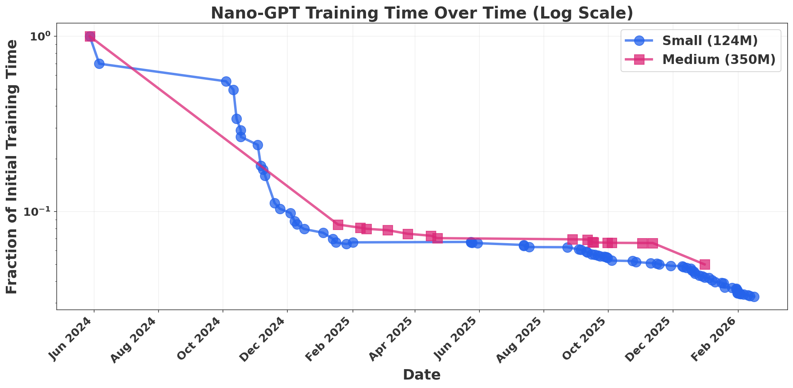
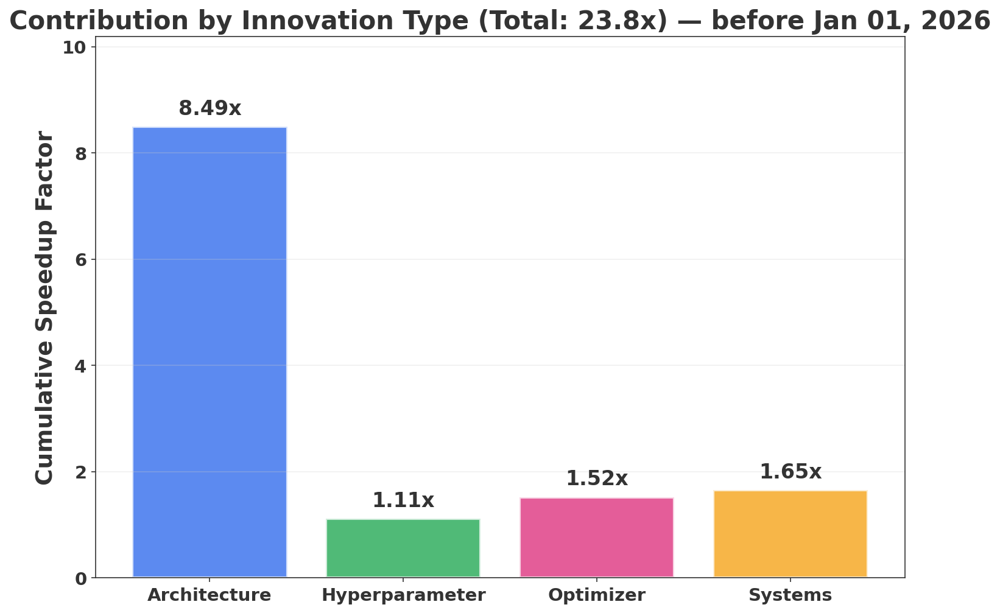
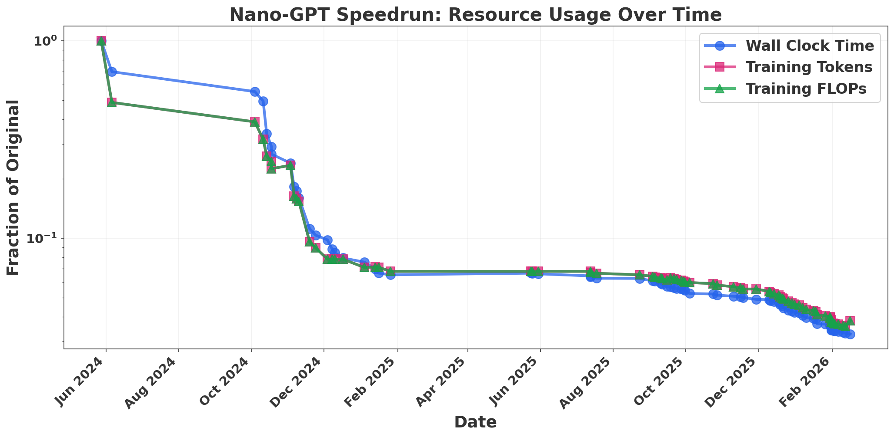
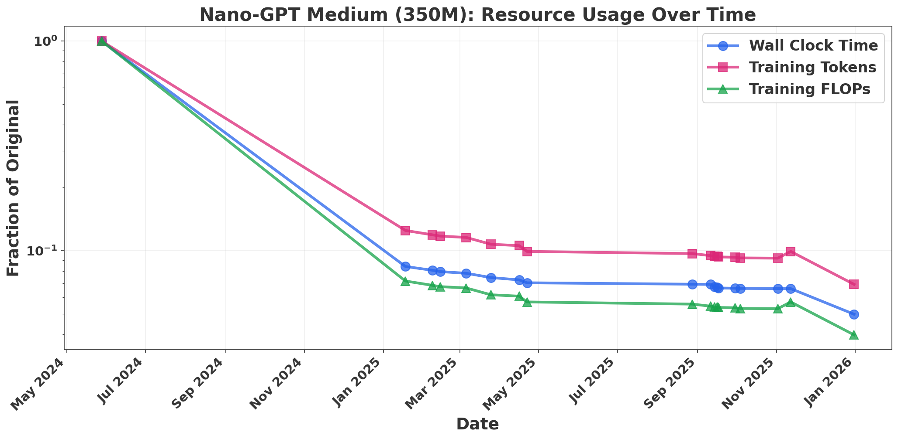
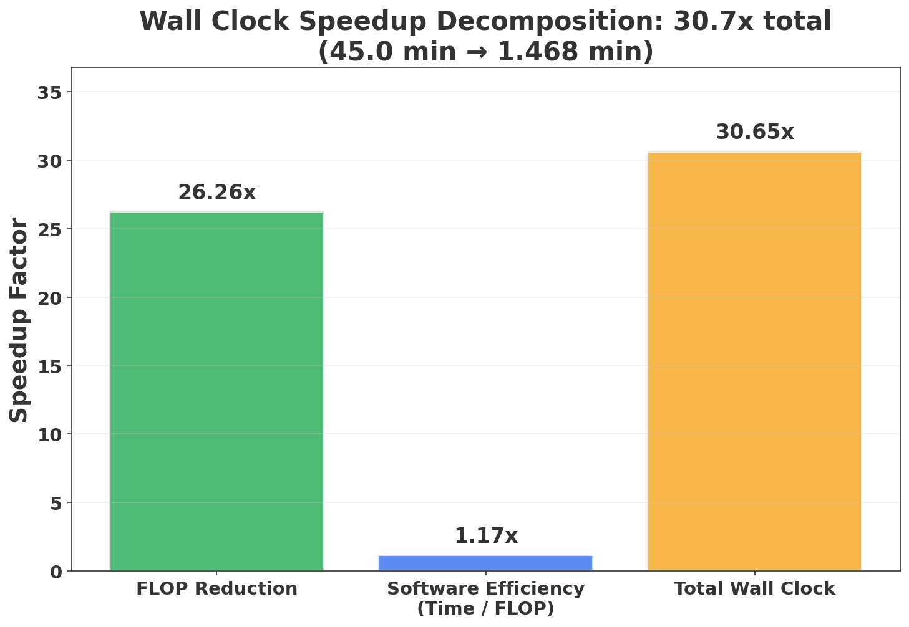
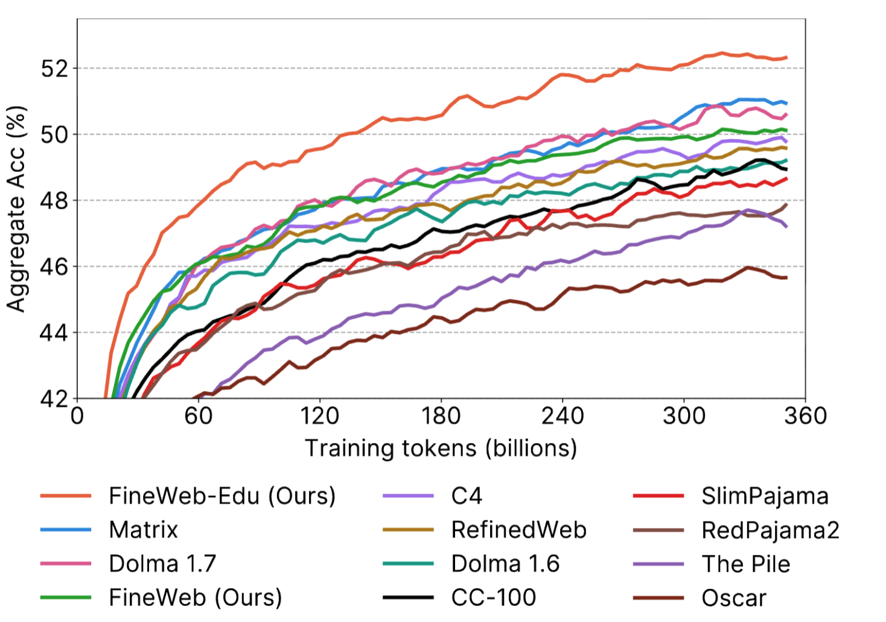
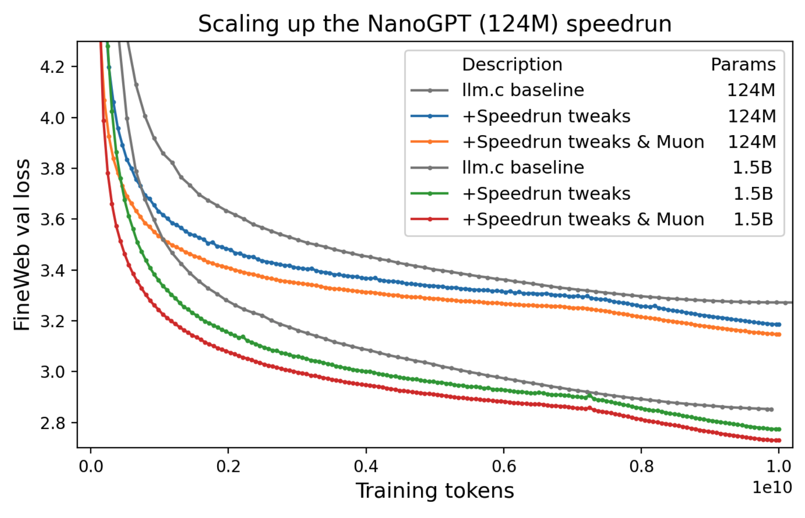
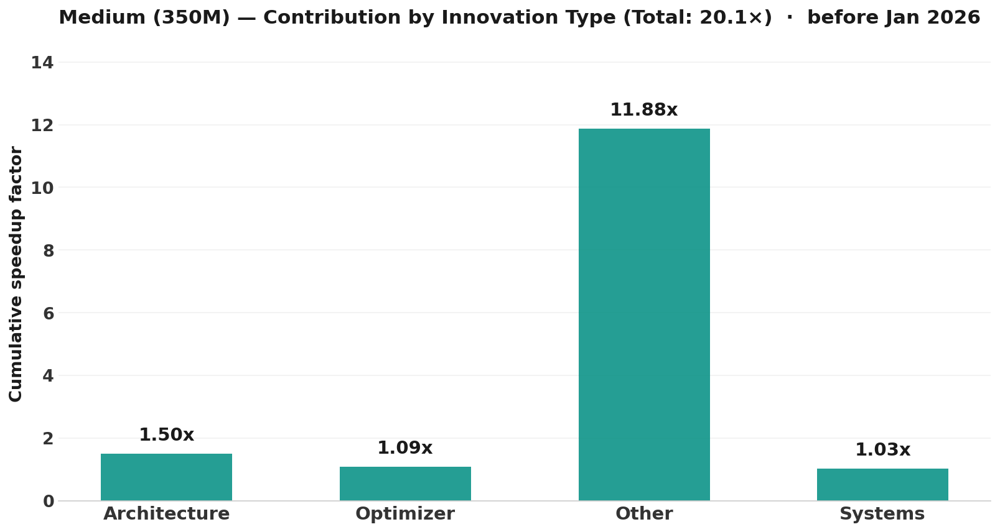
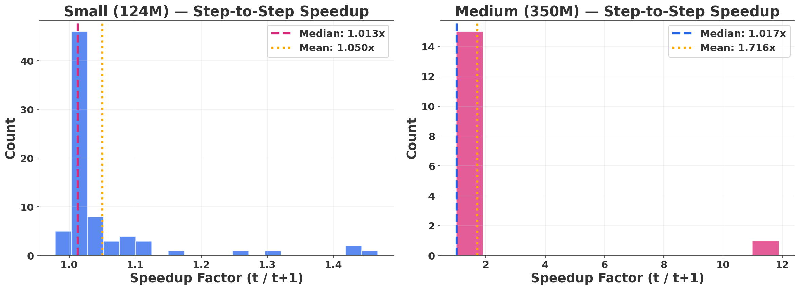

# Measuring the Dark Energy of AI Progress

*Graph of NanoGPT progress over time as a fraction of initial training time at the small and medium scale competition tracks.*

## Acknowledgements

Thanks to Tom Cunningham for inspiring this post. I also want to acknowledge Parker Whitfill's work on NanoGPT and commentary on training-cost progress, and Anson Ho's recent post on this subject, which prompted these discussions. Zachary Brown provided helpful commentary on this manuscript.

## Main Conclusions

- FLOP improvements track wall-clock time well; software and other non-FLOP improvements look relatively minor in comparison.
- Algorithmic progress (at fixed data and size) is around **1.6× per year**. This is smaller than some previous estimates, but fairly close to the overall gains at fixed size measured in our [*On the Origin of Algorithmic Progress*](https://arxiv.org/abs/2511.21622) paper.

Anson Ho has recently argued that algorithmic progress—efficiency improvements that reduce the computational cost of training models to a given capability—is the [least understood driver of AI advancement](https://epochai.substack.com/p/the-least-understood-driver-of-ai). Most of the data on algorithmic progress comes from analyzing papers. In our recent *Origins* paper, we took a more experimental approach, empirically measuring the impact of discovered algorithms on AI capabilities over the period 2012–2023. We found that efficiency improvements from new algorithmic innovations have larger and larger effects as models scale up in compute.

I like to think of this as the **“dark energy” of AI progress**: an unseen force that fundamentally shapes the trajectory of the field, and whose influence only grows at [larger scales](https://en.wikipedia.org/wiki/Scale_factor_(cosmology)).

In this piece, I measure algorithmic progress using a complementary approach: evaluating the cost reduction AI developers have achieved on the [**NanoGPT SpeedRun Benchmark**](https://github.com/KellerJordan/modded-nanogpt). This is a competition to train fixed-loss, fixed-size models at the fastest possible speed. Speedrun competitions like this are a very valuable data source: every record-setting entry is fully documented with architecture, training curves, and wall-clock time, yet they have received little attention in the algorithmic progress literature.

While this benchmark does not capture scale-dependent effects and suffers from benchmark hacking, I think it is a fascinating **model organism** for algorithmic progress. After analyzing this competition, I compare the results to our *Origins* paper.

## The NanoGPT Speedrun

The NanoGPT speedrun benchmark is a collaborative and competitive project aimed at reaching GPT-2 Small validation loss on the FineWebText dataset using **8× H100s** as fast as possible. Contributors make updates to the architecture or training procedure, and entries that improve efficiency are considered world record holders.

Entries are required to have active parameter counts of around **124M** (with some minor variation), the same order of magnitude as GPT-2 Small. The competition also runs a medium version where most entries use **200M-parameter** models (the first entry is 350M parameters). The benchmark has existed since 2024, and the architecture, time, and training curves for every record-setting model are recorded—providing a remarkable chart of algorithmic progress.

Here I set out to see what this data can tell us about the nature of this progress.

## What Is This Progress Made Of?

For each entry in the benchmark, I asked Claude to categorize each of the innovations mentioned in the entry's record log. Many log updates include multiple innovations—for example, “included flash attention and updated Muon.” I asked Claude to choose the **single most representative category** for each record holder, such as “Architecture,” “Optimizer,” and so on.

This process is inherently subjective. I spot-checked the classifications against the logs and they seem fair, though borderline cases exist. The classifications are in the [GitHub repositor](https://github.com/hansgundlach/SpeedRunAnalysis/blob/main/nanogpt_speedrun_records.csv), and some record-holding entries likely made advances across multiple categories.

Here, **“Architecture”** refers to general non-optimizer algorithmic gains such as changing activations, skip connections, and related design choices, rather than broad paradigm shifts like transformers versus diffusion models or recurrent language models.

Overall, **architectural improvements appear to play the largest role** in speedrun progress.

I've included the breakdown for the medium benchmark in the appendix. Most of the advancement in the medium benchmark came from scaling up the innovations exhibited in the small version. However, this happened in essentially one iteration, so we cannot decompose it cleanly into categories like “Architecture,” “Systems,” and so on.

## FLOPs vs. Wall-Clock Time

A large part of the algorithmic progress literature measures progress at the FLOP, or operation, level. However, it is possible to reduce training time without reducing FLOPs—for example, by increasing GPU utilization or using lower-precision arithmetic. Ultimately, what we care about are metrics like **wall-clock time, energy, and cost**, rather than FLOPs alone.

Does this mean the algorithmic progress literature has failed to capture real-world progress?

Parker Whitfill has done some [initial work](https://x.com/whitfill_parker/status/2028515815268491592) suggesting that these non-FLOP improvements are substantial, but still smaller than FLOP improvements. I try to address this more directly by estimating the number of training tokens and training FLOPs used by NanoGPT record holders over time. Methodology and caveats are in the appendix, and more detailed data processing is available on the [GitHub](https://github.com/hansgundlach/SpeedRunAnalysis).

Figure 3 suggests that **FLOP improvements track wall-clock improvements well**. Non-FLOP improvements seem to play a relatively minor role. Thanks to Tom Cunningham for raising this question.

*Wall-clock time and estimated training FLOPs and training tokens over time for NanoGPT speedrun record holders.*

*Wall-clock time vs. estimated FLOPs for GPT-2 Medium speedruns. The FLOP-to-wall-clock gap is larger, but FLOP improvements still look like a good proxy for training improvement.*

*Changes due to FLOP reduction and software-efficiency gains over the benchmark lifetime. Almost all algorithmic gains are FLOP gains as measured by the speedrun.*

Taking data from the benchmark as a whole (2024–2026), non-FLOP improvements account for only about a **1.17×** factor over the entire benchmark period, with the vast majority of wall-clock reduction coming from FLOP reductions.

However, the baseline `llm.c` system was built in 2024 with already highly optimized software—kernel fusion, flash attention, `torch.compile`, and so on. Perhaps non-FLOP improvements were historically very important, but by 2024 there was less room left for them.

To estimate the size of these earlier effects, we can compare the cost of training GPT-2 XL in 2019 against Karpathy's 2024 replication (see appendix for the full calculation). The short version is:

- GPT-2 XL is estimated to have cost **~$43,000–$50,000** to train in 2019. [OpenGPT2](https://medium.com/@vanya_cohen/opengpt-2-we-replicated-gpt-2-because-you-can-too-45e34e6d36dc) [Karpathy](http://x.com/karpathy/status/2017703360393318587?s=20)
- Karpathy replicated it for **$672** in 2024. [Karpathy](https://github.com/karpathy/llm.c/discussions/677)
- Hardware price-per-FLOP improved by roughly **10×** over that period (see Appendix)
- Karpathy's replication used roughly **6× fewer FLOPs**, due to FineWebText improvements and avoiding GPT-2's inefficient multi-epoch training (see data discussion).
- Accounting for these two factors gives: **$50,000 ÷ 10 ÷ 6 ≈ $833**, versus the actual **$672**, leaving a gap of roughly **20–30%** attributable to non-FLOP gains or improvements in model FLOP utilization (MFU).

This seems broadly reasonable. MFU is bounded, and it is hard to identify many other comparable gains over that period. However, the underlying data is noisy: prices and epoch estimates could easily be off by a factor of four, so the residual could range from negligible to reasonably large.

Then why are people investing so much in non-FLOP improvements like flash attention and better parallelism?

Much of this class of improvement is **enabling** rather than directly cost-reducing. These methods make it possible to train much larger models that would otherwise be impractical. Data movement imposes a fundamental limit on the size of language models. Inference scaling is fundamentally limited by KV-cache size and GPU memory. And there are still major systems and utilization challenges in RL training.

## What Is the Rate of Algorithmic Progress at This Scale?

NanoGPT progress looks like a good proxy for GPT-2-style progress from 2019 to 2026. The overall change is consistent with a **1.59× FLOP-efficiency gain per year**.

This is remarkably close to the estimate in our paper for models using around **10^18 FLOPs**, which we interpolate as **1.58× per year** from 2012 to 2023 by taking the CAGR implied by a total **155×** gain over that period. Note that our paper does **not** factor in data progress, but it **does** factor in the switch from Kaplan to Chinchilla scaling, as well as the switch from LSTMs to transformers.

However, there are some inconsistencies.

Our experiments predict a gain of **2.85×** over the 2019–2023 period, where both studies overlap. This is less than the implied 1.59× annual rate over the full period because early innovations, including the transition to transformers, are excluded. Meanwhile, inferring progress over that period from speedrun statistics yields **6.47×**.

My guess is that some of this gap is explained by NanoGPT innovations not scaling to larger models, by over-optimization for the benchmark, and by the inherently high variance of algorithmic progress. But I also think it is likely that we are missing some innovations in that period.

If we factor in **data progress**—that is, some amalgam of Chinchilla optimality, FineWebText, single-epoch training, and related effects—then total speedrun gains rise by around **10×**, from roughly **30×** total to around **300×** (using the GPT-2 Small multiplier). This implies a CAGR of around **2.2×**, which is closer to Ho et al.'s estimate of **2.8×** from [Algorithmic Progress in Language Models](https://arxiv.org/abs/2403.05812).

That said, this factor is hard to interpret cleanly. It looks scale-dependent and is mostly inferred from anecdotal information about GPT-2.

## The Influence of Data

> “If algorithms are the dark energy, then data is the dark matter.”

The NanoGPT speedruns hold data constant, so there is little we can conclude directly about the role of data progress. However, the GPT replication community and Andrej Karpathy's records provide a valuable source for estimating the contribution of data quality, though these estimates are much more uncertain given the large uncertainty around the original GPT-2 training setup.

Karpathy claims that GPT-2 XL was trained on [**100B tokens**](https://x.com/karpathy/status/1795513568655487221) . [GPT-3](https://arxiv.org/pdf/2005.14165) used the same number of tokens across model scales, and given the limited information in the GPT-2 paper, I think it is plausible that GPT-2 did something similar.

Karpathy is able to replicate GPT-2 XL's accuracy on HellaSwag with **fewer than 30B tokens** by training on FineWebText, suggesting an efficiency gain of roughly **3–4×**. His GPT-2 Small replication matches the same HellaSwag accuracy with [**fewer than 10B tokens**](https://github.com/karpathy/llm.c/discussions/481), suggesting a gain of around **10×** relative to the original WebText training. GPT-2 Small, however, was trained less Chinchilla-optimally.

These results seem broadly aligned with training results from the FineWeb paper, where there appear to be multiple regimes: an initial regime where training-efficiency gains are large, a second phase where the savings become roughly a constant additive factor, and a third regime where gains expand again.

The effects of data seem highly nonlinear. In fact, data is one of the paradigmatic examples of a **scale-dependent innovation**.

Still, this is not an entirely fair comparison. GPT-2 was trained for many epochs, while FineWeb replications generally use **single-epoch training**. Karpathy also trained Chinchilla-optimally, while GPT-2 likely did not. On a fair token-to-token efficiency basis, the gains would be much smaller.

This updates me against an [“most progress is data progress”](https://www.beren.io/2025-08-02-Most-Algorithmic-Progress-is-Data-Progress/) view, and toward a view closer to: **it is not the data, but how you use it**. If OpenAI had scaled their dataset to the same size, avoided redundant multi-epoch training, and known the optimal dataset size, they might have trained GPT-2 much more efficiently without improving the underlying information density of the dataset itself.

In our paper, we assume older models were trained in a Kaplan-style manner, but in reality they may have been trained much less efficiently. In this broader sense, **“data + usage of data”** progress looks large—around or larger **10×**.

An important caveat is that these efficiency gains are measured on **HellaSwag**, a specific benchmark. It may not be that FineWebText is generically better; it may simply be much closer to the distribution needed for HellaSwag in particular. As Steven Byrnes has [noted](https://www.lesswrong.com/posts/sGNFtWbXiLJg2hLzK/the-nature-of-llm-algorithmic-progress), the gap between completion-based metrics like perplexity or HellaSwag and other benchmark-specific measures of data quality could be substantial.

I am therefore more sympathetic to “most progress is data progress” when looking at specialized benchmark performance, such as FrontierMath.

*Training curves for different datasets showing accuracy on constant selected benchmark groups. Taken from the FineWeb dataset paper.*

## How Does Scale Influence Things?

In our paper, we find that large-scale architectural changes and scaling practices can have substantial **scale-dependent efficiency gains**. However, the vast majority of algorithmic changes do not have scale-dependent effects.

None of the algorithms in the speedrun clearly fall into this strongly scale-dependent bucket, and we do not see especially strong scale dependence in the NanoGPT data. This is consistent with the smaller change in algorithmic progress at this scale than the change estimated from Ho et al.

Algorithmic gains for the small and medium speedruns look remarkably similar. Interestingly, in NanoGPT we see slightly stronger algorithmic gains in smaller models. Keller Jordan, NanoGPT speedrun founder, mentions that some of these innovations explicitly are [not likely to scale](https://github.com/KellerJordan/modded-nanogpt).

Importantly, these may be what my colleague Zachary Brown calls **scale-specific effects**. These are not gains that steadily increase or decrease with size, but rather hacks that work only at a particular scale—for example, hyperparameter tuning tricks or specific learning-rate adjustments.

Our study only measures changes that have **increasing scale-dependent effects**. This is partly a selection effect, because we chose improvements that were historically most important—those that were, in a sense, “Bitter Lesson–pilled.” Thanks to Anson Ho for pointing this out.

*GPT-2 Large validation-loss training curves taken from the speedrun repository. Speedrun gains look similar at **124M parameters** and **1.5B parameters**, with slightly larger gains at small scales.*

## The Future of NanoGPT and Training Progress

Other mechanisms besides training enhancement may become the dominant form of algorithmic progress. In particular, **inference-training (IT) scaling**—dramatically increasing inference compute while simultaneously reducing its cost through inference-side efficiency gains—could drive large improvements in benchmark performance without any change in training-time algorithmic efficiency.

I sketch this idea further in the appendix, but I think measuring and decomposing IT could become increasingly important, alongside RL training efficiency. I worked on another paper measuring inference-side efficiency gains [here](https://arxiv.org/abs/2511.23455).

I also suspect that NanoGPT progress will not continue indefinitely. Speedruns and other tightly constrained algorithmic tasks eventually hit limits ([rubic cubes](https://www.reddit.com/r/dataisbeautiful/comments/1r2cfid/oc_evolution_of_rubiks_cube_world_record_solve/), [matrix exponent](https://en.wikipedia.org/wiki/Computational_complexity_of_matrix_multiplication#/media/File:MatrixMultComplexity_svg.svg)). But progress has recently sped up, and it seems entirely possible that the benchmark could improve by several more orders of magnitude before plateauing.

For all its faults, I think NanoGPT provides an exciting view of innovation. Progress may be dominated by changes at the largest scales, but there are still remarkable lessons to be learned at the small scale.

## Appendix

### Hardware Price-Performance Progress

A Cloud TPU v3 device delivered roughly 420 TFLOP/s
([Google, 2019](https://cloud.google.com/blog/products/ai-machine-learning/bfloat16-the-secret-to-high-performance-on-cloud-tpus))
at an on-demand rate of $8/hr
([Google Cloud TPU pricing](https://cloud.google.com/tpu/pricing)) (also [Kapathy](https://x.com/karpathy/status/2017703360393318587?s=20)).
An H100 delivers ~1,979 TFLOP/s
([NVIDIA, 2023](https://www.nvidia.com/en-us/data-center/h100/))
at ~$3.44/hr
([Lambda, 2024](https://lambda.ai/pricing)).
This implies a cost per peak FLOP improvement of approximately **11×** over the period from 2019 to 2024.
<!-- 
### Calculating GPT-2 Training Cost and Hardware Progress

In 2019, a TPU v3 pod hour cost roughly **$8** and could perform around **420 TFLOP/s**. Karpathy used **8× H100s for 24 hours** to train GPT-2 XL for **$672**, implying a cost of roughly **$3.50 per GPU-hour**—fairly high, but reasonable for 2024. Current prices are approximately **$2–3 per H100-hour**.

Adjusting by an H100's peak BF16 throughput relative to a TPU v3, we get a hardware price-per-FLOP improvement very close to **10×** over this period. -->

### Epoch Estimates for GPT-2
This is a direct quote from Epoch's [model database](https://epoch.ai/data/ai-models): 
"
Estimating based on:

**compute = 6 FLOP/token/parameter × epochs × parameters × tokens**

A 40GB dataset is approximately **8 billion words**, or:

\[
\frac{1}{0.75} \times 8\text{B} = 10.66\text{B tokens}
\]

The number of epochs is not reported, but:

- another paper [[1]](https://arxiv.org/abs/1906.06669) claims in Table 1 that it is **20 or 100 epochs**
- another paper [[2]](https://www.usenix.org/system/files/sec21-carlini-extracting.pdf) claims **12 epochs** based on communication with the GPT-2 authors (page 4)

**12 epochs** is the modal, most credible value.  
The mean of the probability mass is probably around **20 epochs**, so calculating from that value:

\[
6 \times (40 \times 200\,\text{million} \times \frac{1}{0.75} \times 20) \times 1.5\,\text{billion parameters} = 1.92 \times 10^{21}
\]

WolframAlpha calculation:  
<https://www.wolframalpha.com/input?i=6+FLOP+*+20+*+%2840+billion+%2F+5+*+%284%2F3%29%29+*+1.5+billion>
<!-- 
## References

[1] [One Epoch Is All You Need](https://arxiv.org/abs/1906.06669)  
[2] [Extracting Data From Large Language Models](https://www.usenix.org/system/files/sec21-carlini-extracting.pdf)

It also appears the model was trained on **TPU v3** chips:  
<https://huggingface.co/openai-community/gpt2>
" -->

<!-- 
### Cost Decomposition: 2019 vs. 2024

Starting from the estimated 2019 training cost of **$43,000–$50,000** for GPT-2 XL:

- **Hardware:** ~10× price-per-FLOP improvement (TPU v3 → H100)
- **FLOP reduction:** ~6× fewer FLOPs in Karpathy's replication (better data, no multi-epoch waste)
- **Expected cost after these factors:** ~$50,000 ÷ 60 ≈ $833
- **Actual cost:** $672
- **Residual (software/MFU):** ~20–30%

This residual is consistent with MFU improvements of up to around **3×** over the period. Note that the uncertainty on the input estimates is large—potentially around **4×** on both prices and epochs—so the residual could range from negligible to substantial.

### SpeedRun Advancement Structure

**[Fig.]** Distribution of advancement factors in the medium speedrun. The vast majority of records improve on previous records by a modest factor. This reinforces my view of a “great algorithms” picture of efficiency progress. -->

### Medium Speedrun Advancement Structure

*Most of the gains in the medium speedrun competition cannot be precisely accounted for because of the details of that benchmark. However, the ratio of improvement factors seems to roughly reflect the ratio seen for the small speedrun in the main document.*

### Distribution of Improvments

*Distribution of advancement factors in the medium speedrun. The vast majority of records improve on previous records by a modest factor. This reinforces my view of a great algorithms view of efficiency progress.*

## GitHub

More detailed information on the data processing and Claude's classification methodology is available at: **[https://github.com/hansgundlach/SpeedRunAnalysis](https://github.com/hansgundlach/SpeedRunAnalysis)**
